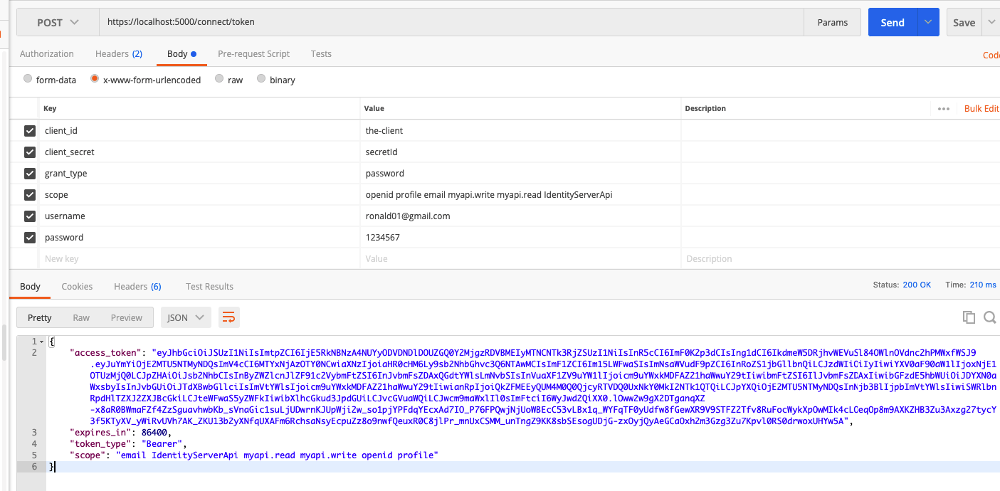

# Identity Server 4

### Migration command:

```
dotnet ef migrations add InitialIdentityServerPersistedGrantDbMigration -c PersistedGrantDbContext -o Data/Migrations/IdentityServer/PersistedGrantDb --project identity-server
dotnet ef migrations add InitialIdentityServerConfigurationDbMigration -c ConfigurationDbContext -o Data/Migrations/IdentityServer/ConfigurationDb --project identity-server
```

**Configuration Store:** is used for encapsulating the configuration data and tables such as clients, resources and scopes.

**Operational Store:** is keeping the temporary data such as authorization codes and refresh tokens. For a better understanding I do encourage you to read the [Identity Server docs](https://identityserver4.readthedocs.io/).

URL: documention for configuration http://localhost:5000/.well-known/openid-configuration

### API Resourcer

In the API resourcer you should add IdentityServer4.AccessTokenValidation NuGet package.

### Create First User:

Enpoint: http://localhost:5000/signup

"email": "ronald@gmail.com",
"firstName": "Ronald",
"lastName": "Castillo",
"password": "1234567"

### Authentication from client using Postman

* client_id: it's identifier of the client that can use identity server for access
* cliente_secret: this key identify our client
* grant_type: it's provider support in this case is  ResourceOwnerPassword
* scope: these are difference permission
* username:
* password:




##### Resources:

https://damienbod.com/2020/02/10/create-certificates-for-identityserver4-signing-using-net-core/

https://docs.microsoft.com/en-us/archive/blogs/kaevans/using-powershell-with-certificates

http://docs.identityserver.io/en/latest/topics/add_apis.html

https://jwt.io/

https://feras.blog/how-to-use-asp-net-identity-and-identityserver4-in-your-solution/

https://neelbhatt.com/2018/02/24/identityserver4-in-simple-words-identityserver4-with-net-core-part-i/

https://stackoverflow.com/questions/31385593/identity-server-not-returning-refresh-token
